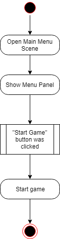
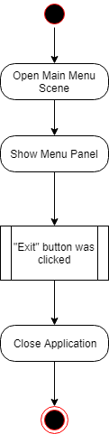
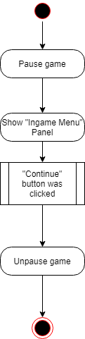
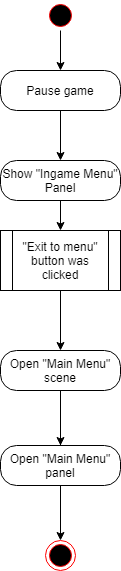

# Диаграммы активностей
---

# Содержание
## Главное меню
* [Start Game Button](#start_game)  
* [Exit Button](#exit)  
## Внутриигровое меню
* [Continue](#continue)  
* [Exit to Menu](#exit_to_menu)  

# ГЛАВНОЕ МЕНЮ
<a name="start_game"/>

# Start Game Button
  

<a name="stats"/>
  
# Exit Button

# ВНУТРИИГРОВОЕ МЕНЮ
<a name="continue"/>

# Continue Button

<a name="save_and_exit"/>

# Exit to Menu Button

